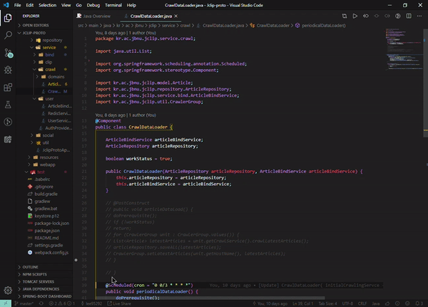

(**This project will be updated from May 2020.** )

# Testfile-generator-for-Junit README

It provides (editor,explorer)context menu for generating Junit test file.

## Features

- Context menu on editor, explorer.
- prevent overload your file if test file already exist.
  

## Known Issues

Working at Gradle/Maven project in windows system is confirmed.

## Release Notes

### 0.0.3

### 0.0.\*
